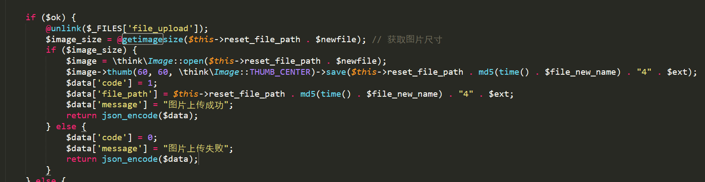
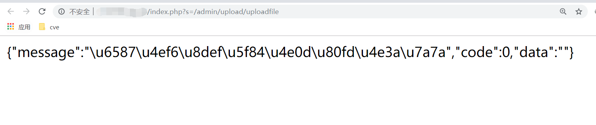
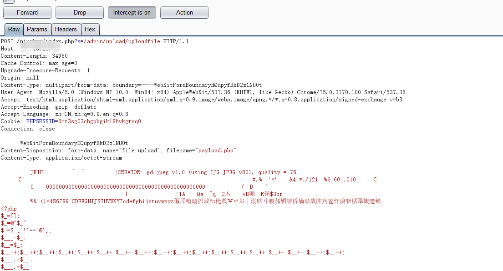
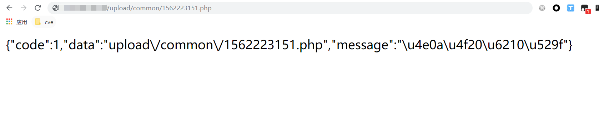
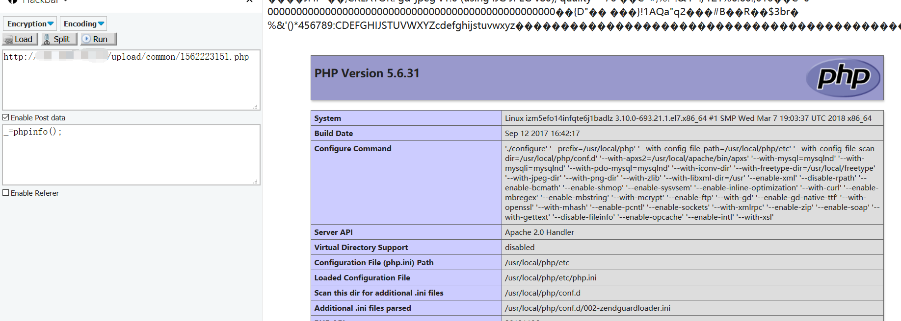

# Niushop B2B2C 单商户 V2.3 文件上传漏洞

说明：NiuShop开源商城系统是一套PHP开源电子商务系统。Niushop B2B2C 单商户V2.3，可以绕过管理员验证获取后台上传接口，通过参数上传，绕过getimagesize函数，上传php文件，getshell.

## 1.技术说明

位于\application\admin\controller\upload.php 行：757~!769

此处采用getimagesize函数验证上传文件是否为图片，很容易被绕过

## 2.poc
通过代码审计找到上传接口，用户不需要登录即可访问。

通过参数file_uopload和file_path两个参数post数据，上传php文件

上传成功！返回路径

getshell
