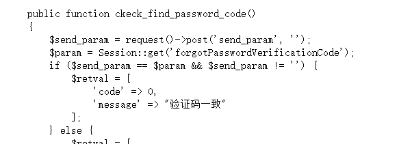
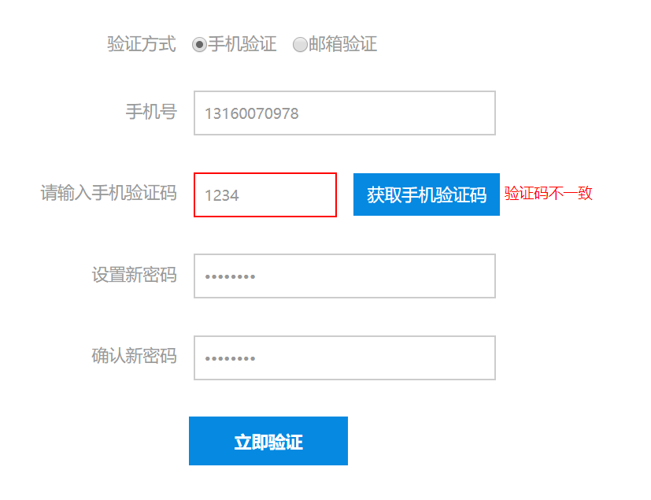
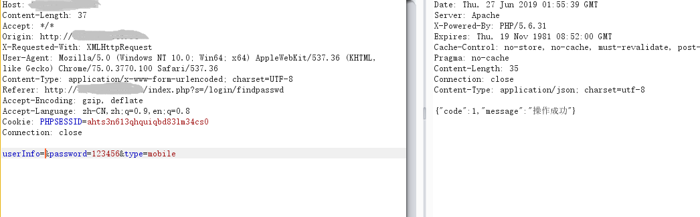
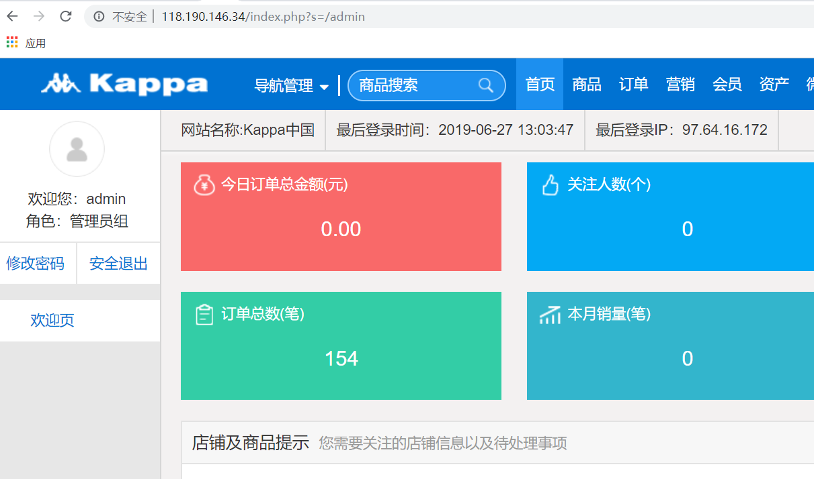

# Administrator password reset in Niushop B2B2C Multi-business basic version V1.11

Description: The NiuShop open source mall system is a set of PHP open source e-commerce system. In Niushop B2B2C Multi-Business Basic Edition V1.11, authentication can be bypassed, causing administrators to reset any passwords.
## 1. Technical description

Located at \application\shop\controller\Login.php Line: 757~!769

Here the verification code is verified with php "==", which can be bypassed by weak php type

## 2.poc
Normal submission will show inconsistent verification code

Use the burstsuit to capture the package, add an array after the send_parem, you can bypass the weak type of php and not empty.

Because the verification code is already recognized, you can reset the password by submitting the administrator’s mobile number to null.

login successful！
