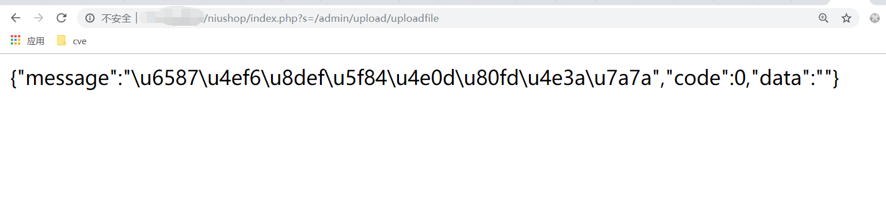
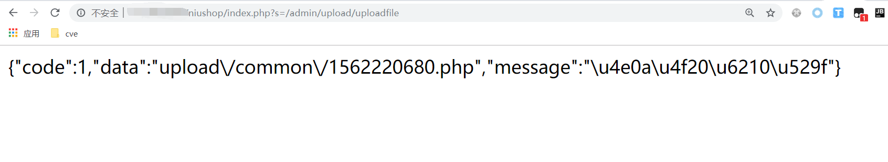

# Niushop B2B2C Single Merchant V2.3 File Upload Vulnerability

Description: The NiuShop open source mall system is a set of PHP open source e-commerce system. Niushop B2B2C single merchant V2.3, can bypass the administrator to obtain the background upload interface, through parameter upload, bypass the getimagesize function, upload php file, getshell.

## 1.技术说明

Located at \application\admin\controller\upload.php line: 116~156

It uses the getimagesize function to verify that the uploaded file is an image. This is easy to bypass

## 2.poc
The upload interface is found through code auditing, and the user does not need to log in to access.

Upload php file by parameter data of parameter parameter_uopload and file_path

Uploaded successfully! Return path！

getshell！！
